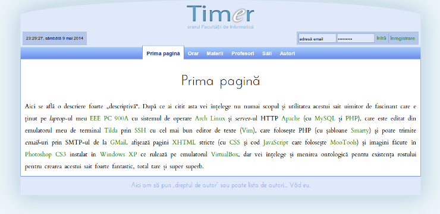

# Timr

My project for my [Web Technologies][1] course in 2010.

## Install

### Install Smarty

    wget http://www.smarty.net/files/Smarty-2.6.28.tar.gz
    tar -xzf Smarty-2.6.28.tar.gz
    sudo cp Smarty-2.6.28/libs /usr/share/php/Smarty

## Run it

Run with:

    php -S localhost:8000

and navigate to [localhost:8000](http://localhost:8000).

## License

MIT

[1]: http://profs.info.uaic.ro/~busaco/teach/courses/web/
